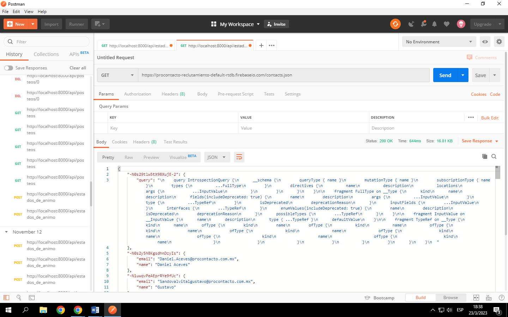
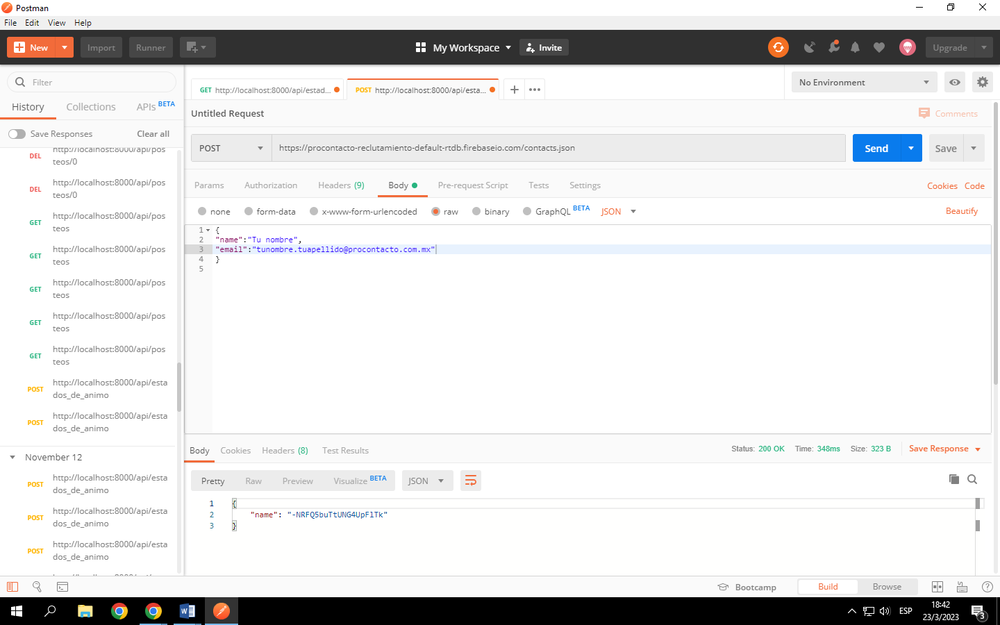

# ProContacto-Evaluacion-Practica
Evaluacion practica realizada para una entrevista realizada por la empresa ProContacto.

## EJERCICIO 2
1-	Que es un servidor Http
Es un servidor el cual tiene como objetivo intercambiar información entre un servidor y un cliente/usuario, mantiene esta estructura cliente-servidor utilizando el protocolo HTTP el cual permite realizar una petición de datos y recursos. Se realiza mediante conexiones que son bidireccionales o unidireccionales. Este protocolo permite

2-	Que son los verbos HTTP
Los verbos HTTP son distintas palabras que son utilizadas para realizar peticiones al servidor, los más utilizados son:
- GET: Recupera información de un recurso
- PUT: Reemplaza la información de un recurso. Utilizado para actualizar información. Puede devolver informacion.
- POST: Crea un recurso. Devuelve el código 201 que significa la correcta creación del nuevo recurso/instancia.
- DELETE: Utilizado para suprimir un recurso identificado.

3- ¿Qué es un request y un response en una comunicación HTTP? ¿Qué son los headers? 
Un request es la peticion que realiza el cliente al servidor,esta es realizada junto con un metedo (como lo puede ser Get) y una URL.Un response es la respuesta que el servidor realiza al tener una peticion, devuelve un codigo de status junto con la informacion requerida en la peticion. En ambos casos se especifica el tipo de lenguaje, que púede ser XML, Jason, etc.
Los Headers contienen informacion de los metadatos

4- ¿Qué es un queryString? (En el contexto de una url)
Forma parte de la URL, contiene los datos que deben pasar a las API. Estas cadenas de consultas permiten acceder a paginas web dinamicas. Al final de la url se pone el caracter "?" y luego se puede incluir uno o mas parametros representados como clave-valor (Clave=Valor). Esta Query lo que realiza es devolver una informacion especifica, la cual se obtiene buscando sobre los valores mensionados luego del caracter.

5- ¿Qué es el responseCode? ¿Qué significado tiene los posibles valores devueltos?
Es un codigo que se devuelve en un response por parte del servidor, el cual indica el estado de la peticien realizada por el navegador web del cliente ( la requiest ). Este indica como se realizo la request, puede tener un valor negativo como positivo (404 0 200 por ejemplo).
Hay distintos tipos de codigo, por lo general los 1xx informan respuestas informativas,
2xx informa que la request realizada se resolvio con exito, una peticion correcta.
3xx se utiliza para redirecciones,
4xx es utilizada para informar errores por parte del CLIENTE 
5xx informa un error por parte del servidor,base de datos.

6- ¿Cómo se envía la data en un Get y cómo en un POST?

7- ¿Qué verbo http utiliza el navegador cuando accedemos a una página?
Este realiza un metodo GET, ya que pide todos los recursos necesarios para obtener los datos/archivos de la pagina. Por ejemplo trae los archivos css,js,html,etc.

8- Explicar brevemente qué son las estructuras de datos JSON y XML dando ejemplo de estructuras posibles.
Ambos son un formato de intercambio de datos, estandares utilizados para intercambiar informacion.
Formato XML : basado en texto y en el uso de etiquetas. permite una adecuada representacion estructurada de la informacion,ya sean datos o documentos.
Las etiquetas empiezan con <> y siempre deben cerrarse con </>. Dentro de cada etiqueta puede estar vacia o tener contenido y distintos elementos. Este estandar tambien permite agregar atributos, añade propiedades a un elemento.
Caracteristicas: es un formato complicado de trabajar por las personas y mantiene un formato estricto.
Ejemplo: 

Formato JSON (JavaScript Object Notation): presenta la informacion mas legible para las personas. Este formato se basa en un subconjunto concreto del lenguaje de programacion JavaScript. Este protocolo utiliza una serie de pares de Nombre y valor en orden. 
Caracteristicas: Es un formato simple y trabaja con una velocidad de procesamiento alta
Ejemplo: 

9- Explicar brevemente el estándar SOAP
Simple Object Access Protocol conocido por su abreviatura SOAP, es un protocolo de red basado en XML que define como diseñar infercaces de programacion de aplicaciones (API). Es ideal para las empresas, ya que esta bien definida por una serie de reglas integradas que aumentan la complejidad y la sobrecarga.
Es independiente del transporte, aunque habitualmente se utiliza con el protocolo http. Se definen tres partes en todo el mensaje:
- Sobre: Define una infrasestructura para describir que hay en un mensaje y como procesarlo
- Reglas de codificacion: Instancia de tipos de datos definidos por la aplicacion. Normas de codificacion que definen un mecanismo de serializacion.
- Estilos de comunicacion: Puede seguir el formato RPC ( llamada de procedimiento remoto ) o estilo de documento.
Caracteristicas: Seguridad,atomicidad,aislamiento,uniformidad,durabilidad.Grantiza operaciones confiables en la base de datos.

10- Explicar brevemente el estándar REST Full

Es un servicio doble via, consulta y respuesta, que dos sistemas computados utilizan para intercambiar informacion de manera segura a traves de internet.
Una consulta debe especificar parametros de consulta para que el servicio sepa lo que se quiere consultar. Por lo general el cuerpo de la respuesta de una API con este estandar es una estructura con el formato JSON. Este estandar trabaja sobre el protocolo HTTP.

11- ¿Qué son los headers en un request? ¿Para qué se utiliza el key Content-type en un header?

Los headers transmiten 

## EJERCICIO 3
1- 

2- 

3- En el punto 1 vimos como al realizar un metodo GET el servidor nos devuelve un recurso en formato JSON el cual contiene una cantidad X de informacion sobre usuarios con sus respectivos mails y nombres, los cuales se pueden identificar por un TOKEN. En cambio, en el punto 2 vimos como al realizar un metodo POST mandamos un recurso al servidor con informacion del cliente, la cual el servidor GUARDA en la base de datos y nos devuelve como respuesta el codigo TOKEN de nuestra informacion.

## EJERCICIO 4 

## EJERCICIO 5

https://trailblazer.me/id/lrodriguez353

## EJERCICIO 6 

### Soluciones Salesforce

a) ¿Que es salesforce?
Es una compañia en la nube con sistema de CRM, que alamacena sus datos de clientes, le da procesos para cuidar a clientes potenciales y proporciona maneras para colaborar con personas que trabajan con empresas. Da la posibilidad de personalizar funciones para potenciar la aplicacion de manera unica para cada empresa,clientes,empleados y socios, esto se logra con salesforce platform.

Existen algunos términos aquí cuya comprensión es de capital importancia: confianza, capacidad multiusuario, metadatos y la API.

Algunas ejemplos de las tareas que puede realizar salesForce: Gestiona  y mejora la eficiencia de ventas, simplifica procesos de creacion y realizacion de pedidos, conecta a sus empleados.

b) ¿Qué es sales cloud?

## EJERCICIO 7 

